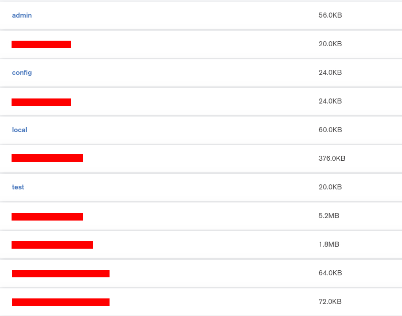
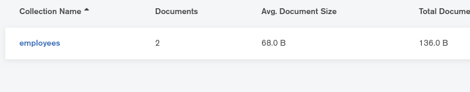
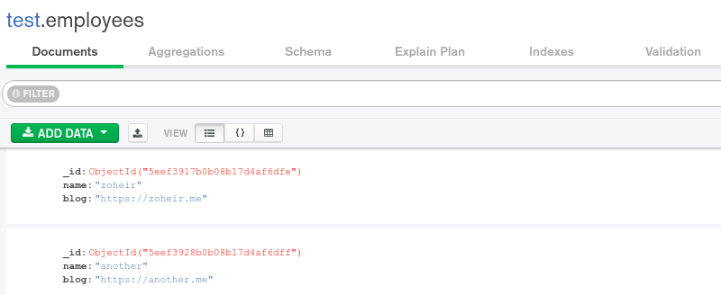
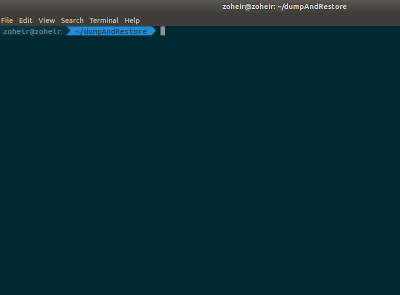
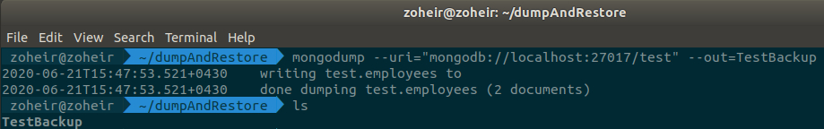
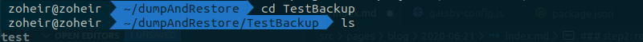
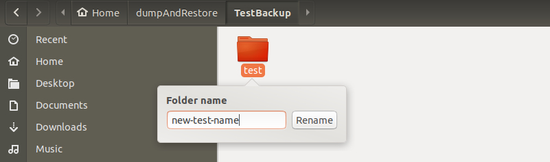
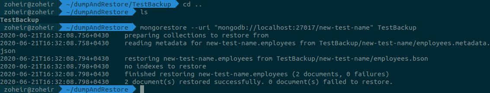
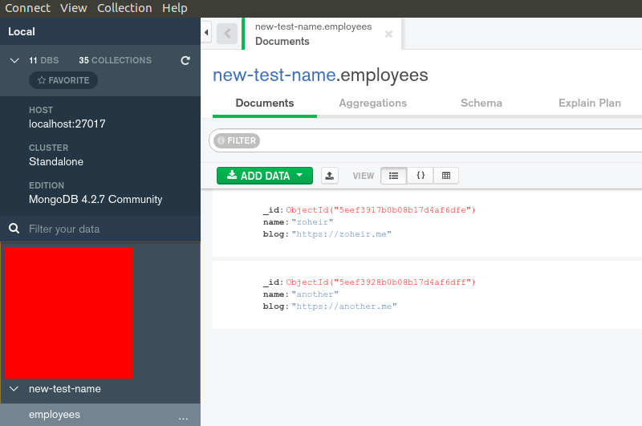

First of all before I start writing about MonogDB dump and restore I want to say I'm happy because I decided to write again in the blog. 
My feeling is something like this GIF :smile:


### story
So, here is the story. Every time I wanted to import and export a db in MongoDB I forget the commands and their paramaters. I decided to write about it here once and when I couldn't remember them I just open this page and go on :))

### step 1: dump
If you want to backup your mongodb database you should use `mongodump` command in the terminal:

```mongodump [options]```

Here is my mongodb connection : `mongodb://localhost:27017/`. I connected to that with `MongoDB Compass` and here is my databases:



I'm gonna work with test db. test db has a collection called `employees`:



`employees` collection includes two `documents`:



I'm in this directory now:


> Question : How to export (`dump`) our `test` database ?
<br />

Answer : run this command on terminal: <br />
`mongodump --uri="mongodb://localhost:27017/test" --out=TestBackup`<br />
>`--uri` : full mongodb connection string in our case `test` is name of our db that I mentioned above <br />

>`--out` : is our backup directory in our case is `TestBackup` <br /> 

here is the result of the command and after enter `ls` command you'll see `TestBackup` is created:

So now export operation is done :fire:

### step2: restore
If you want to import your database from your backup you should use `mongorestore` command in the terminal:

```mongorestore [options]```

before that let's take a look at our `TestBackup` directory. you will see there is a directory called `test` that is name of our `test` databse.

So, if we're gonna import import this backup with new database name we should change this directory name. I'll change that to `new-test-name`


> Question : How to import (`restore`) our `new-test-name` database ? <br />

Answer : go one directory backward and run `ls` command on terminal: <br />
If you could see `TestBackup` directory in the terminal you are in the correct directory path.
Then you should run this command to import your backup to new database that called `new-test-name`: <br />
`mongorestore --uri "mongodb://localhost:27017/new-test-name" TestBackup`

<p> And BOOOOM! import operation is done :fire: </p>

Now you can see your new database with your data in the `MongoDB Compass`:
