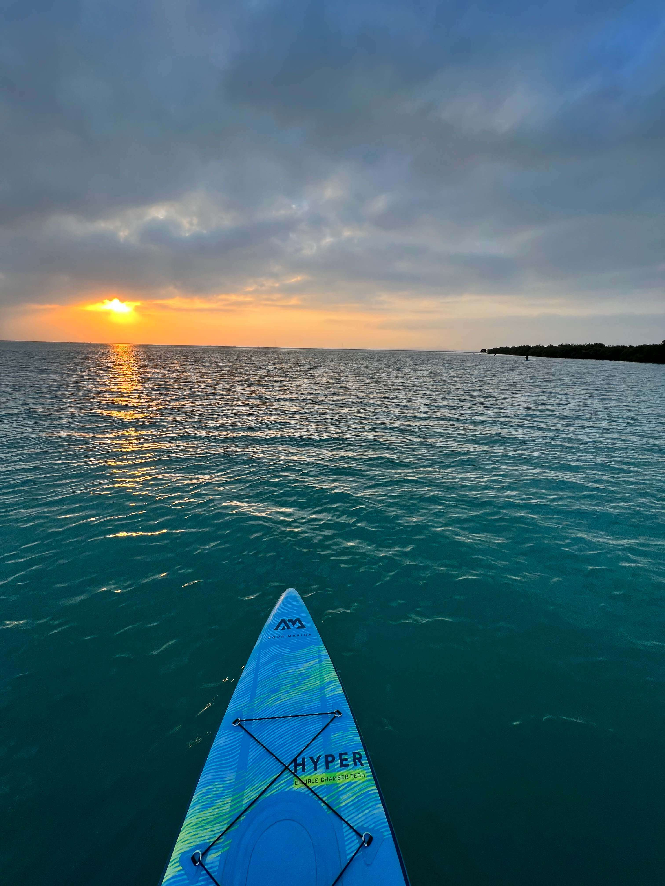
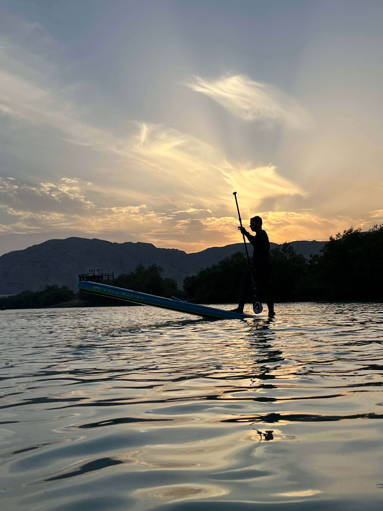
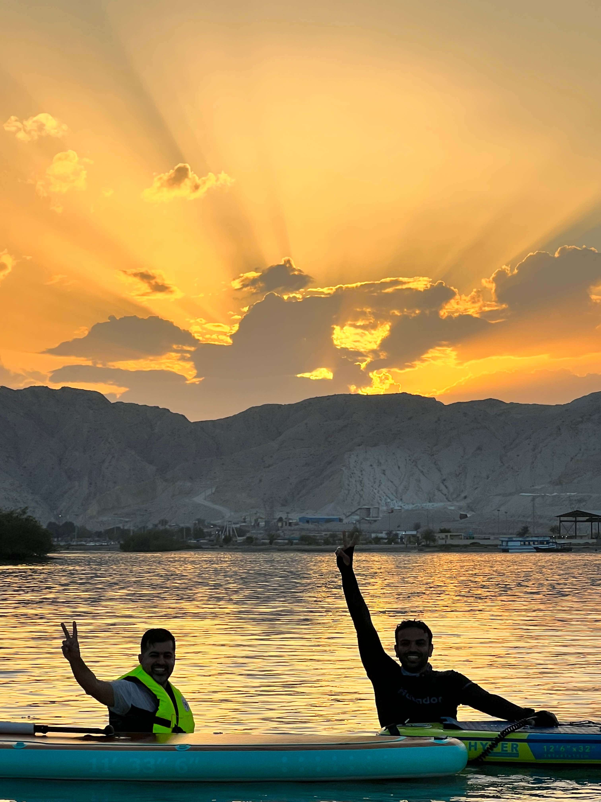
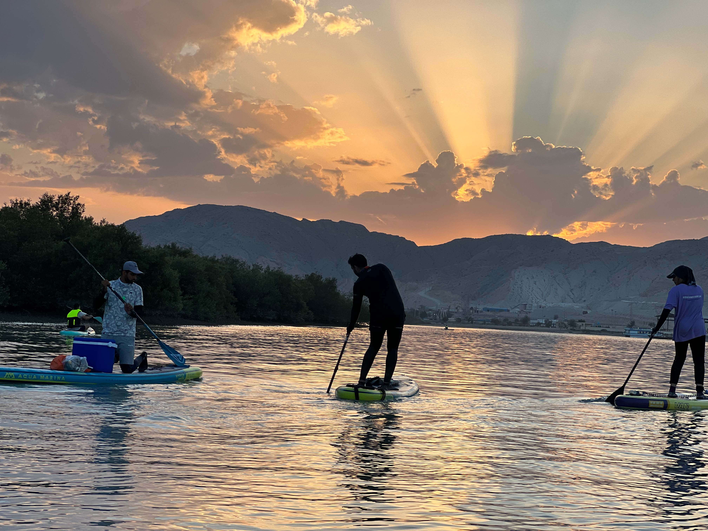

It's been a while since last time I posted something here. I've been busy with work most of the time. I just wanted to update this blog but I was postponing it, always.

I've been working as Back-end Developer at RedAcre LTD for almost about 2 years. I quit my job on September 2022 and since that time I started focusing to level-up my technical skills.

I learnt the React basic stuff during past couple of months. Now days I'm learning Next.js and other modern technologies. I have a project on my plate that is in progress and I'm gonna use what I learnt during my career path to build this project. This project is going to be an online coffee shop application that users will be able to order coffee or whatever they want from its menu. It's called **[Dope-coffee](https://github.com/wave-coding/dope-coffee)**

About a couple of months ago, I and two other friends of mine founded a water sport kind of club and we teach people **[SUP (Standup paddleboarding)](https://en.wikipedia.org/wiki/Standup_paddleboarding)**. it's been a cool experience for me having some sort of outdoor activities with people and having daily interactions with them. I'm saying this because I used to spend my time with only my self but I found this club as an opportunity to socialize more with people who I might don't know them.

I changed my lifestyle during past 3 years and I do workouts and I go to the gym at least 4 days/week. I cook by myself as well and I can cook a lot of healthy and delicious food.

Since I quit my job at RedAcre LTD, it's been a tough time for all of us as Iranian due to protests and the ongoing revolution that has been started in the first days of September 2022 due to the Death of #MahsaAmini who has been tortured and killed by the Islamic regime. The regime has been shutting down the internet and restricted our access to the global internet. We had to use VPN in order to get rid of censorship, however, the regime is always blocking our servers IPs and that's something we're all dealing with all the time.

If I'm being honest I feel a little bit blue recently because of the situation in my country. There is a combination of feelings like insecurity and anxiety both together that stuck with you when you wake up the morning and I feel like there is a butterfly in my stomach, most of the time.
I'm trying to find a solution to get rid of this situation that I'm dealing with.

It's tough but I know myself. I can survive. I'm tougher than this shitty situation.

As **[Eminem](https://en.wikipedia.org/wiki/Eminem)** said: 
> There's no limit on how far I would go, no boundaries, no lengths.

