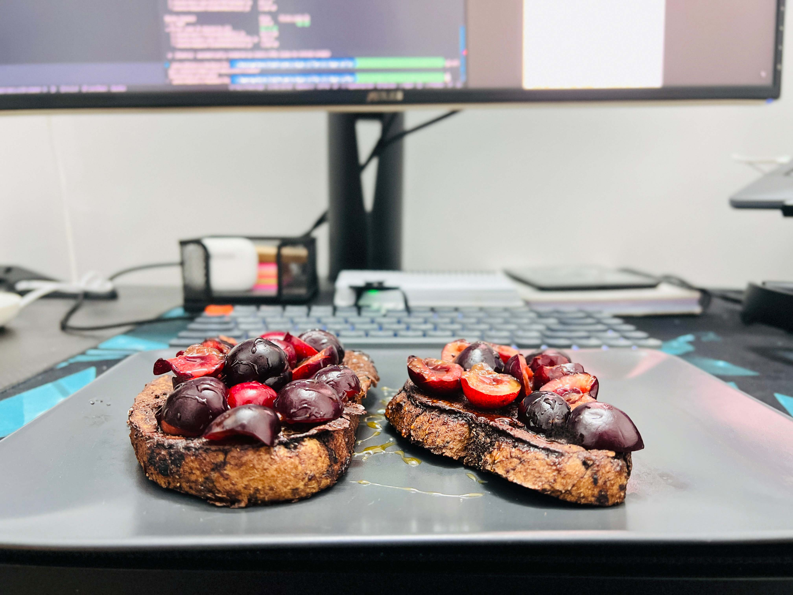
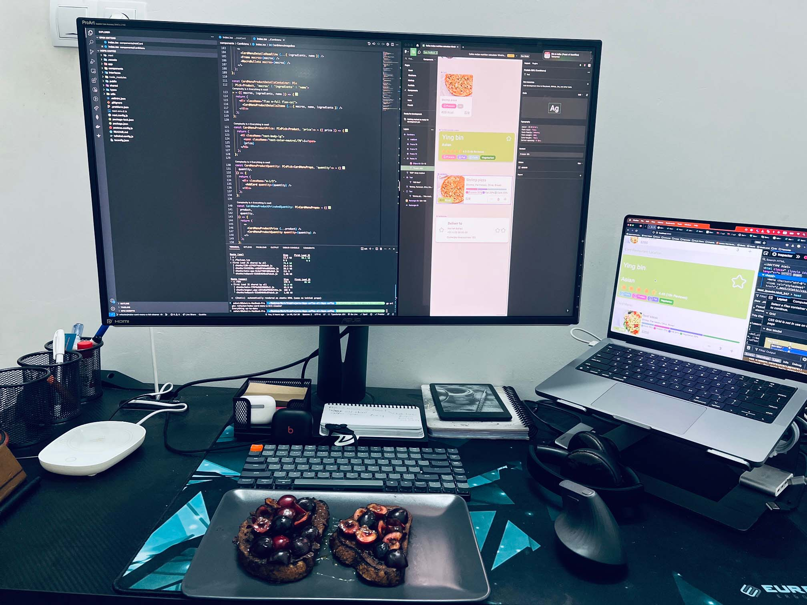
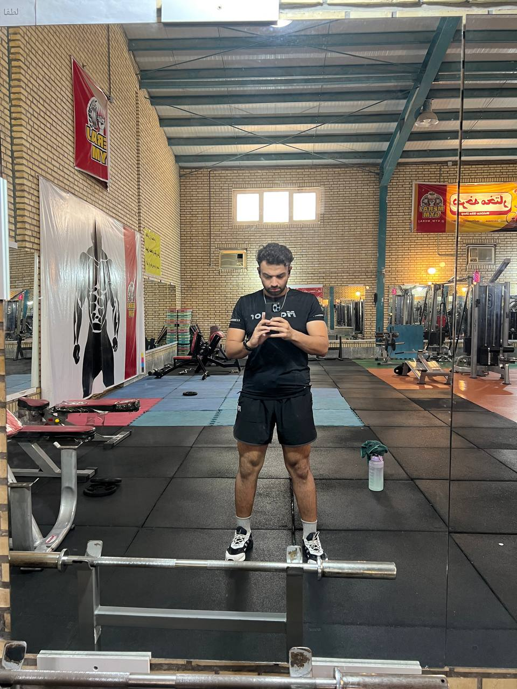

Hello, world!
Today, I'm gonna talk about my recent journey that took almost two months and it's about developing Front-End side of the **[Dope-coffee](https://github.com/wave-coding/dope-coffee)**. 
This was the first time I chose this approach rather than watching a course about how to develop a FE application. 
I actually started watching a course but it didn't make sense to me. At this point of my journey as a developer I felt bored by watching a course that is always about some stupid app with basic fundamental of the tools that I'm gonna use for my project so, I decided to forget about the course. 
So, I started implementing the FE components based on Figma design that has been designed by my friend, **[Hanieh Kaheli](https://haniehkaheli.com)**. She is a UI/UX designer and also a cool/sweet friend. 
Since my goal was to use and learn ReactJS I started with reading ReactJs docs. fortunately the new version of the react was released with NextJS 13 if I'm not mistaken. So I digged into their docs and I could be able to initialize the project. 
The great point of using NextJs is that in the latest releases, Typescript and TailwindCSS are somehow fully configured and there is no more work to be done to start developing with TailwindCSS and Typescript on it. 
So I looked into the design and I started configuring **[`tailwind.config.js`](https://github.com/wave-coding/dope-coffee/blob/main/tailwind.config.js)** based on typography, colors and some design settings that has been defined by the designer.

After configuring TailwindCSS and main css file started creating small pieces of components. I chose FlexBox to do the items alignment because I already knew it better that CSS Grid (I might use this one in the future :D ).

the main challenge on designing components was that there was no npm or third-party package for icons that has been used in the design. so I had to export each on of the icons as a SVG code and make An Icon component out of it and the I could be able to use it. **[Icon.tsx](https://github.com/wave-coding/dope-coffee/blob/main/components/Icon/index.tsx)**
To finish this part, I had a lot of challenges and doubts about how to do it and my cool/kind friend **[Mohammad Amin Faraji](https://github.com/itsaminfaraji)** who was also my co-worker and is a great software engineer helped me out to find the solution.

I used ChatGPT plugin on VS Code as well, it helped me a lot when I wanted to optimize the component or maybe refactor it. this was my first serious mission of getting my hands dirty with this AI tool. From my point of view it's a great to use it as an assistant and it's really helpful and it wasn't scary as I thought of before. ChatGPT code analyzing is very good and I found it better that other AI tools like that one that has been provided by AWS (because I used that one as well).

Yesterday, I finished implementing all of the components and from now on I'm gonna work on combining them together and create application pages. Next chapter is write tests for those components and also refactor them if it's needed.

Here is the demo of dope coffee components if you're carious you can watch it on youtube:
`youtube: https://www.youtube.com/watch?v=ZxAUdSmawG8`
Beside work, I've been doing my workout sessions properly and I feel great about my healthy life-style. 
I cook chocolate pancakes for the breakfast most of the week however, recently my cute/cool friend Rosa recommended me to try french toast as well. I tried and it was very delicious and after that if you're my guest for breakfast these two options are available in the menu :D.  
I go for walking every night and take at least 10000 steps/day. I go walking beside the beach and I enjoy observing the moonlight during that time. 
Living close to sea is peaceful. It's like meditation. I really like these days however during the summer it's very hot out there and sometime it makes me crazy because I'm more into cold weather than the hot one :D
There is a dog in our neighborhood and it's been living there for a while and every night when I go for a walking she comes with me. it feels good to have a dope dog around.
She's like a dope/kind friend :)
Also, I found a great podcast called (**[Andrew Huberman Lab](https://www.youtube.com/@hubermanlab)**), sometimes I listen to it and take a note when I'm go walking.

I heard this quote in a song called Kids and Heroes by The **[Bouncing Souls](https://en.wikipedia.org/wiki/The_Bouncing_Souls)** and I thinks it's beautiful: 
> In the end, it's all a question of heart.

